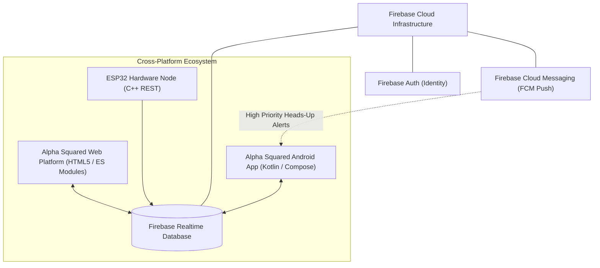

# ALPHA SQUARED — Future Android Native App Specification
**Team Alpha Squared &bull; Government Polytechnic Gaya**

This specification defines how a future native Android application (built in Kotlin with Jetpack Compose) integrates directly with the shared Firebase Realtime Database backend and authentication model.

---

## 1. Architectural Compatibility Model



---

## 2. Shared Kotlin Data Models

A native Android app can mirror the database schema using these data classes:

```kotlin
package org.alphasquared.iot.model

import com.google.firebase.database.IgnoreExtraProperties

@IgnoreExtraProperties
data class PatientProfile(
    val fullName: String = "",
    val age: Int = 0,
    val bloodGroup: String = "",
    val assignedDeviceId: String = "",
    val emergencyNotes: String = ""
)

@IgnoreExtraProperties
data class CurrentTelemetry(
    val patientId: String = "",
    val deviceId: String = "",
    val heartRate: Int = 0,
    val spo2: Int = 0,
    val temperature: Float = 0.0f,
    val fallDetected: Boolean = false,
    val sosPressed: Boolean = false,
    val emergencyState: String = "NORMAL", // NORMAL, WARNING, EMERGENCY
    val emergencyReason: String? = null,
    val latitude: Double = 0.0,
    val longitude: Double = 0.0,
    val locationSource: String = "DEVICE_GPS",
    val timestamp: Long = 0L,
    val isDemo: Boolean = false
)

@IgnoreExtraProperties
data class EmergencyEvent(
    val eventId: String = "",
    val eventType: String = "", // CRITICAL_VITALS, FALL_EVENT, MANUAL_SOS
    val reason: String = "",
    val vitalsAtEvent: Map<String, Any>? = null,
    val latitude: Double = 0.0,
    val longitude: Double = 0.0,
    val locationSource: String = "",
    val timestamp: Long = 0L,
    val status: String = "TRIGGERED", // TRIGGERED, ACKNOWLEDGED, RESOLVED
    val acknowledgedBy: String? = null,
    val resolvedBy: String? = null,
    val resolutionNotes: String? = null
)
```

---

## 3. Realtime Observation in Jetpack Compose ViewModel

```kotlin
class TelemetryViewModel : ViewModel() {
    private val database = Firebase.database.reference
    private val _telemetryState = MutableStateFlow<CurrentTelemetry?>(null)
    val telemetryState: StateFlow<CurrentTelemetry?> = _telemetryState.asStateFlow()

    fun attachTelemetryListener(patientId: String) {
        val currentRef = database.child("patients").child(patientId).child("current")
        currentRef.addValueEventListener(object : ValueEventListener {
            override fun onDataChange(snapshot: DataSnapshot) {
                val data = snapshot.getValue(CurrentTelemetry::class.java)
                _telemetryState.value = data
            }

            override fun onCancelled(error: DatabaseError) {
                Log.e("TelemetryViewModel", "RTDB listen failed", error.toException())
            }
        })
    }
}
```

---

## 4. Caregiver Push Notifications via FCM

When `emergencyState == "EMERGENCY"`, a Firebase Cloud Function or serverless API sends a high-priority FCM payload to caregiver Android devices, triggering:
1. Full-screen emergency intent with siren sound override
2. Direct launch into Google Maps turn-by-turn navigation using `latitude` and `longitude`
3. One-tap incident acknowledgement button directly on the Android notification drawer.

